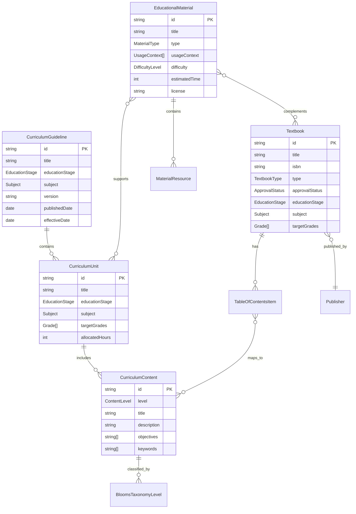

# 日本の教育データアーキテクチャ

## 概要

このドキュメントでは、Open Tenjin MCPで扱う日本の教育データの構造と関係性について説明します。

## 教育システムの階層構造

```
文部科学省
├── 学習指導要領（全国共通基準）
│   ├── 教育段階別
│   │   ├── 小学校
│   │   ├── 中学校
│   │   ├── 高等学校
│   │   └── 特別支援学校
│   └── 教科別詳細内容
│
├── 教科書検定制度
│   ├── 検定基準
│   ├── 出版社別教科書
│   └── 採択地域別使用状況
│
└── 教育課程実施状況調査
    ├── 全国学力・学習状況調査
    └── 教育課程実施状況調査
```

## データモデルの関係図



## 学習指導要領の構造

### 階層レベル

1. **目標（Goal）**: 教科全体の目標
2. **内容（Content）**: 具体的な学習内容
3. **項目（Item）**: 内容の詳細項目
4. **詳細（Detail）**: 具体的な指導事項

### 例：小学校算数「数と計算」

```
算数科の目標（Goal）
├── 数と計算（Content）
│   ├── 数の概念（Item）
│   │   ├── 10までの数（Detail）
│   │   ├── 100までの数（Detail）
│   │   └── 大きな数（Detail）
│   └── 四則計算（Item）
│       ├── 加法・減法（Detail）
│       ├── 乗法（Detail）
│       └── 除法（Detail）
```

## ブルームのタキソノミーとの対応

| レベル | 日本語 | 学習指導要領での表現例 |
|--------|--------|------------------------|
| Remember | 記憶 | 「覚える」「暗記する」 |
| Understand | 理解 | 「理解する」「わかる」 |
| Apply | 応用 | 「使う」「活用する」 |
| Analyze | 分析 | 「調べる」「比較する」 |
| Evaluate | 評価 | 「判断する」「評価する」 |
| Create | 創造 | 「作る」「表現する」 |

## 教科書検定制度との関係

### 検定プロセス

```
出版社 → 検定申請 → 文部科学省審査 → 検定合格 → 採択 → 使用
```

### データでの表現

```typescript
interface Textbook {
  approvalStatus: ApprovalStatus; // 検定状況
  approvalNumber?: string;        // 検定番号
  curriculumMapping?: string[];   // 学習指導要領との対応
}

enum ApprovalStatus {
  APPROVED = 'approved',          // 検定済み
  AUTHORIZED = 'authorized',      // 認定済み
  PENDING = 'pending',           // 検定中
  NOT_REQUIRED = 'not_required'  // 検定不要
}
```

## 教材分類システム

### 利用場面による分類

| 段階 | 英語 | 日本語 | 学習指導過程での位置 |
|------|------|--------|---------------------|
| Introduction | 導入 | 興味・関心を引く段階 |
| Explanation | 展開 | 理解を深める段階 |
| Practice | 練習 | 技能を定着させる段階 |
| Assessment | 評価 | 理解度を確認する段階 |
| Review | 復習 | 学習内容を振り返る段階 |
| Homework | 宿題 | 家庭学習での活用 |
| Enrichment | 発展 | より高度な学習への発展 |

### 教材タイプによる分類

```
デジタル教材
├── 動画（Video）
├── 音声（Audio）
├── インタラクティブ（Interactive）
└── ゲーム（Game）

印刷教材
├── ワークシート（Worksheet）
├── スライド（Slide）
└── 参考資料（Reference）

体験型教材
├── 実験教材（Experiment）
└── 評価教材（Assessment）
```

## 地域との関係

### 教育委員会レベルでの実装

```
都道府県教育委員会
├── 教科書採択地域の指定
├── 地域の教育方針
└── 独自教材の作成・配布

市区町村教育委員会
├── 教科書の採択
├── 地域教材の活用
└── 学校への指導・支援

学校
├── 教育課程の編成
├── 教材の選択・活用
└── 授業実践
```

### データでの表現

```typescript
interface RegionalImplementation {
  prefectureCode: string;        // 都道府県コード
  municipalityCode: string;      // 市区町村コード
  adoptedTextbooks: string[];    // 採択教科書ID
  localMaterials: string[];      // 地域教材ID
  specialPrograms: string[];     // 特色ある取り組み
}
```

## 特別支援教育への対応

### インクルーシブ教育の視点

```
学習指導要領
├── 通常の学級での配慮事項
├── 特別支援学級での指導
└── 特別支援学校での教育課程

教材・教具の工夫
├── 視覚的支援
├── 聴覚的支援
├── 認知的支援
└── 身体的支援
```

### データでの配慮

```typescript
interface AccessibilityFeature {
  visualSupport: boolean;        // 視覚支援
  auditorySupport: boolean;      // 聴覚支援
  cognitiveSupport: boolean;     // 認知支援
  motorSupport: boolean;         // 運動支援
  multiSensory: boolean;         // 多感覚活用
}

interface EducationalMaterial {
  // 既存のプロパティ...
  accessibility?: AccessibilityFeature;
  adaptations?: string[];        // 教材の適応方法
}
```

## 評価との関係

### 新学習指導要領の評価観点

```
知識・技能
├── 各教科等における見方・考え方を働かせた深い学び
└── 基礎的・基本的な知識及び技能の習得

思考・判断・表現
├── 課題の発見・解決に向けた主体的・協働的な学び
└── 思考力・判断力・表現力等の育成

主体的に学習に取り組む態度
├── 見通しを持った粘り強い取り組み
└── 自己の学習を調整する力
```

### データでの表現

```typescript
interface EvaluationCriteria {
  knowledgeSkills: string[];           // 知識・技能
  thinkingJudgmentExpression: string[]; // 思考・判断・表現
  autonomousAttitude: string[];         // 主体的に学習に取り組む態度
}

interface CurriculumUnit {
  // 既存のプロパティ...
  evaluationCriteria?: EvaluationCriteria;
}
```

## 国際比較の観点

### PISA・TIMSSとの関連

```typescript
interface InternationalAlignment {
  pisaDomain?: 'reading' | 'mathematics' | 'science';
  timssSubject?: 'mathematics' | 'science';
  competencyFramework?: string;
  globalGoals?: string[];           // SDGs等との関連
}
```

## データ品質管理

### データソースの信頼性

1. **公式データ**: 文部科学省公開データ
2. **検証済みデータ**: 教育関係者によるレビュー
3. **コミュニティデータ**: 利用者からの貢献

### バージョン管理

```typescript
interface DataVersion {
  version: string;              // セマンティックバージョニング
  releaseDate: Date;           // リリース日
  changes: string[];           // 変更内容
  compatibilityNotes: string[]; // 互換性に関する注記
}
```

この教育データアーキテクチャに基づいて、Open Tenjin MCPは一貫性のある、包括的な日本の教育データを提供します。